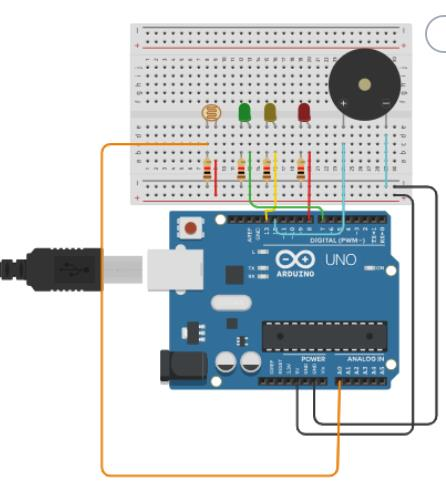

<h1>Projeto Vinheria Agnello</h1>
Este projeto tem como objetivo o desenvolvimento de um sistema de monitoramento de luminosidade para uma vinheria, garantindo que os vinhos sejam armazenados em condições ideais de iluminação, já que à luz excessiva pode comprometer a qualidade dos vinhos, por isso é essencial manter os níveis de luminosidade sob controle.

<h2>Níveis de luminosidade e sistema de aviso<h2>

LED Verde: Nível de luminosidade OK.

LED Amarelo: Nível de alerta.

LED Vermelho: Nível crítico ou problema.

Buzzer: Ativado por 3 segundos quando a luminosidade estiver em nível de alerta.

<h2>Componentes Utilizados</h2>

Arduino Uno

1x Sensor LDR

1x Resistor de 10kΩ (para o LDR)

1x LED Verde

1x LED Amarelo

1x LED Vermelho

3x Resistores de 220Ω (para os LEDs)

1x Buzzer

Jumpers e Protoboard

<h3>Plataforma</h3>

<h2>Como Reproduzir o Projeto</h2>

Crie uma conta ou entre em sua conta existente em: tinkercad.com

Monte o circuito virtual:

Adicione os componentes listados acima.

Configure o sensor LDR com um resistor de 10kΩ formando um divisor de tensão conectado a uma entrada analógica (ex: A0).

Ligue os LEDs e o buzzer em pinos digitais.

Implemente o código:

Insira o código de controle com analogRead para o LDR, digitalWrite para os LEDs e tone() para o buzzer.

Defina os limiares de luminosidade para os estados "OK", "Alerta" e "Crítico".

Inicie a simulação:

Clique em "Start Simulation" e ajuste manualmente a luminosidade do LDR no Tinkercad para testar os comportamentos.

